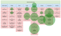
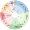
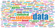
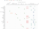

## Awesome official statistics software [](https://github.com/sindresorhus/awesome)

#### An item on this list is awesome because it is:
1. free, open source, available for download and
2. used in the production of, or provides access to, official statistics.

We prefer software that is easy to install and use and actively maintained. [Contributions](#contributions) welcome.

#### News
- Dec 2023: List presented at **uRos2023**: [abstract](https://olavtenbosch.github.io/pdf/2023_Uros_tenBosch_Access.pdf), [slides](https://olavtenbosch.github.io/pdf/2023_Uros_tenBosch_Access_slides.pdf)
- Jun 2023: List highlighted in [71th CES conference](https://unece.org/statistics/events/CES2023)
- Jan 2023: *ESS principles on open source software* building on this list: [ESS principles on OSS](https://os4os.pages.code-europa-eu.gitlab.host/pbbp/principles.html)
- Oct 2022: List mentioned in [UNECE SDE 2022](https://unece.org/statistics/events/SDE2022)
- Mar 2022: *The awesome list of official statistics software & FOSS best practices* [slides](https://doi.org/10.5281/zenodo.7665189)
- Nov 2021: List in keynote Edwin de Jonge at **[uRos2021](http://r-project.ro/conference2021.html#Edwin_de_Jonge)**
- Nov 2021: List in **[ICDSOS2021](https://icdsos.stis.ac.id/2021/)**
- Oct 2021: List in **[Px-meeting 2021](https://www.scb.se/en/services/statistical-programs-for-px-files/px-web/px-meeting-2021/)**: [slides](https://www.scb.se/globalassets/vara-tjanster/px-programmen/2021-10-21-multilingual-px-files-with-r-and-pxjob-.pdf)
- Jan 2021: List in **[10th Expert Group meeting on SDMX](https://www.imf.org/en/News/Seminars/Conferences/2021/01/25/10th-statistical-data-and-metadata-exchange)**: [slides](https://www.imf.org/-/media/Files/News/Seminars/2021/SDMX/siv-presentation-01-stocktaking-of-sdmx-tools.ashx)
- Dec 2020: List presented at **uRos2020**: [slides](https://r-project.ro/conference2020-presentations.html#Olav_TEN_BOSCH,_Mark_VAN_DER_LOO_and_Alexander_KOWARIK)
- Dec 2019: **100  items on the list!!!**
- Jun 2019: List presented at **UNECE Modernstats World**: [slides](https://www.unece.org/fileadmin/DAM/stats/documents/ece/ces/ge.58/2019/mtg2/MWW2019_Soapbox_Netherlands_ten_Bosch.pdf)
- Dec 2017: List started during UNECE SDE 2017


#### Visuals
[](https://observablehq.com/@olavtenbosch/visualizing-awesomeofficialstatistics-org#GSBPM)
[](https://observablehq.com/@olavtenbosch/clickable-awesomeofficialstatistics-org)
[](https://observablehq.com/@olavtenbosch/visualizing-awesomeofficialstatistics-org#wordCloud)
[](https://observablehq.com/@olavtenbosch/access-to-official-statistics-from-r)


*****

<!-- THE LIST OF APPS IS GENERATED FROM data/software.yaml -->
 

#### Design frame and sample ([GSBPM](https://unece.org/statistics/modernstats/gsbpm) 2.1)

- </img> </img> </img>\
R package [SamplingStrata](https:&#x2F;&#x2F;cran.r-project.org&#x2F;package&#x3D;SamplingStrata). Optimal Stratification of Sampling Frames for Multipurpose Sampling Surveys.
- </img> </img> </img>\
R package [R2BEAT](https:&#x2F;&#x2F;cran.r-project.org&#x2F;package&#x3D;R2BEAT). Multistage Sampling Allocation and PSU Selection.


#### Design variable descriptions ([GSBPM](https://unece.org/statistics/modernstats/gsbpm) 2.2)

- </img> </img> </img>\
Excel [SDMX_Matrix_Generator](https:&#x2F;&#x2F;gitlab.com&#x2F;sis-cc&#x2F;sdmx-tools&#x2F;sdmx-matrix-generator). Excel-based visual SDMX artefact authoring tool which generates SDMX-ML for upload into an SDMX repository such as a registry. By OECD.


#### Sampling ([GSBPM](https://unece.org/statistics/modernstats/gsbpm) 4.1)

- </img> </img> </img>\
R package [sampling](https:&#x2F;&#x2F;cran.r-project.org&#x2F;package&#x3D;sampling). Several algorithms for drawing survey samples, including a variety of unequal probabiltiy sampling designs (high entropy, systematic, Rao-Sampford, etc.), and calibrating design weights.
- </img> </img> </img>\
R package [surveyplanning](https:&#x2F;&#x2F;cran.r-project.org&#x2F;package&#x3D;surveyplanning). Tools for sample survey planning, including sample size calculation, estimation of expected precision for the estimates of totals, and calculation of optimal sample size allocation.
- </img> </img> </img>\
R package [PracTools](https:&#x2F;&#x2F;cran.r-project.org&#x2F;package&#x3D;PracTools). Functions and datasets related to Valliant, Dever, and Kreuter (2018 2nd ed), [*Practical Tools for Designing and Weighting Survey Samples*](https:&#x2F;&#x2F;doi.org&#x2F;10.1007&#x2F;978-3-319-93632-1).
- </img> </img> </img>\
R package [prnsamplr](https:&#x2F;&#x2F;cran.r-project.org&#x2F;package&#x3D;prnsamplr). Coordinated stratified sampling using permanent random numbers (PRN&#39;s). Supports simple random sampling and probability-proportional-to-size sampling and includes a function for transforming PRN&#39;s to control the sample overlap.
- </img> </img> </img>\
R package [sps](https:&#x2F;&#x2F;cran.r-project.org&#x2F;package&#x3D;sps). Implements the sequential Poisson method for drawing probability-proportional-to-size samples. Includes tools to coordinate samples with permanent random numbers, draw stratified samples, and use other order-sampling methods.


#### Scraping for Statistics ([GSBPM](https://unece.org/statistics/modernstats/gsbpm) 4.3)

- </img> </img> </img>\
Java application [GUrlSearcher](https:&#x2F;&#x2F;github.com&#x2F;SummaIstat&#x2F;GUrlSearcher). An application for searching Urls via Google. Can be used to find websites of enterprise. By ISTAT.
- </img> </img> </img>\
Java application [Url_scorer](https:&#x2F;&#x2F;github.com&#x2F;SummaIstat&#x2F;Url_scorer). Gives a rule based score to scraped documents in a Solr database. By ISTAT.
- </img> </img> </img>\
Node.js tool [RobotTool](https:&#x2F;&#x2F;github.com&#x2F;SNStatComp&#x2F;RobotTool). A tool for checking (price) changes on the web. By Statistics Netherlands.
- </img> </img> </img>\
Python [Social-Media-Presence](https:&#x2F;&#x2F;github.com&#x2F;jmaslankowski&#x2F;WP2-Social-Media-Presence). A script for detecting social media presence on enterprises websites. By Statistics Poland.
- </img> </img> </img>\
Python [Sustainability_Reporting](https:&#x2F;&#x2F;github.com&#x2F;AlessandraSozzi&#x2F;MSc-dissertation). A script for measuring sustainability reporting from enterprises websites. By ONS.
- </img> </img> </img>\
Python [urlfinding](https:&#x2F;&#x2F;github.com&#x2F;SNStatComp&#x2F;urlfinding). Software for finding websites of enterprises using a search engine and machine learning. By [Statistics Netherlands](https:www.cbs.nl).


#### Process ([GSBPM](https://unece.org/statistics/modernstats/gsbpm) 5)

- </img> </img> </img>\
R package [dcmodify](https:&#x2F;&#x2F;cran.r-project.org&#x2F;package&#x3D;dcmodify). Derive new variables or modify data using externally defined data modification rules.
- </img> </img> </img>\
Java application [Trevas](https:&#x2F;&#x2F;github.com&#x2F;InseeFr&#x2F;Trevas). Java engine for the Validation and Transformation Language (VTL). By INSEE.
- </img> </img> </img>\
Java application [Java-VTL](https:&#x2F;&#x2F;github.com&#x2F;statisticsnorway&#x2F;java-vtl). A partial implementation of the Validation Transformation Language, based on the VTL 1.1 draft specification. By Statistics Norway.
- </img> </img> </img>\
R package [blaise](https:&#x2F;&#x2F;cran.r-project.org&#x2F;package&#x3D;blaise). Reading and writing Files in the Blaise Format from R. By Statistics Netherlands.
- </img> </img> </img>\
Java application [ADaMSoft](http:&#x2F;&#x2F;adamsoft.sourceforge.net). implements procedures for data analysis, data, web and text mining. Also contains procedures for data validation and imputation, based on the principle of Fellegi and Holt.


#### Data integration and record linkage ([GSBPM](https://unece.org/statistics/modernstats/gsbpm) 5.1)

- </img> </img> </img>\
R package [reclin2](https:&#x2F;&#x2F;cran.r-project.org&#x2F;package&#x3D;reclin2). Functions to assist in performing probabilistic record linkage and deduplication: generating pairs, comparing records, em-algorithm for estimating m- and u-probabilities, forcing one-to-one matching. Can also be used for pre- and post-processing for machine learning methods for record linkage.
- </img> </img> </img>\
R package [RecordLinkage](https:&#x2F;&#x2F;cran.r-project.org&#x2F;package&#x3D;RecordLinkage). Implementation of the Fellegi-Sunter method for record linkage.
- </img> </img> </img>\
R package [StatMatch](https:&#x2F;&#x2F;cran.r-project.org&#x2F;package&#x3D;StatMatch). Statistical Matching or Data Fusion
- </img> </img> </img>\
R package [fastLink](https:&#x2F;&#x2F;cran.r-project.org&#x2F;package&#x3D;fastLink). Implements a Fellegi-Sunter probabilistic record linkage model that allows for missing data and the inclusion of auxiliary information. [Documentation](http:&#x2F;&#x2F;imai.princeton.edu&#x2F;research&#x2F;linkage.html).
- </img> </img> </img>\
R packages [stringdist](https:&#x2F;&#x2F;cran.r-project.org&#x2F;package&#x3D;stringdist). Approximate string matching. Supports various string distances (Damerau-Levenshtein, Hamming, Levenshtein, optimal sting alignment), qgrams (q- gram, cosine, jaccard distance) and heuristic metrics (Jaro, Jaro-Winkler). An implementation of soundex is provided as well.
- </img> </img> </img>\
R packages [fuzzyjoin](https:&#x2F;&#x2F;cran.r-project.org&#x2F;package&#x3D;fuzzyjoin). Join tables based on exact or similar matches. Allows for matching records based on inaccurate keys.
- </img> </img> </img>\
R Java MySQL [RELAIS](https:&#x2F;&#x2F;joinup.ec.europa.eu&#x2F;solution&#x2F;relais-record-linkage-istat&#x2F;releases). A toolkit providing techniques for dealing with record linkage. The purpose is to identify the same real world entity that can be differently represented in data sources. By Istat.
- </img> </img> </img>\
R package [XBRL](https:&#x2F;&#x2F;cran.r-project.org&#x2F;package&#x3D;XBRL). Extraction of Business Financial Information from [XBRL](https:&#x2F;&#x2F;www.xbrl.org&#x2F;).


#### Statistical data editing and imputation ([GSBPM](https://unece.org/statistics/modernstats/gsbpm) 5.3 | 5.4)

- </img> </img> </img>\
R package [validate](https:&#x2F;&#x2F;cran.r-project.org&#x2F;package&#x3D;validate). Data validation checks such as on length, format, range, missingness, availability, uniqueness, multivariate checks, statistical checks and checks on SDMX codelist. See [Cookbook](https:&#x2F;&#x2F;data-cleaning.github.io&#x2F;validate&#x2F;). By Statistics Netherlands.
- </img> </img> </img>\
R package [validatedb](https:&#x2F;&#x2F;cran.r-project.org&#x2F;package&#x3D;validatedb). [validate](https:&#x2F;&#x2F;CRAN.R-project.org&#x2F;package&#x3D;validate) on a SQL database, providing validation on bigger data.
- </img> </img> </img>\
R package [validatetools](https:&#x2F;&#x2F;cran.r-project.org&#x2F;package&#x3D;validatetools). Checking validation rules on redundancies and contradictions. Useful if your validation rule set grows in complexity.
- </img> </img> </img>\
R package [errorlocate](https:&#x2F;&#x2F;cran.r-project.org&#x2F;package&#x3D;errorlocate). Error localisation based on Fellegi and Holt, supporting categorical and&#x2F;or numeric data, linear equalities, inequalities and conditional rules and MIP-based error localization.
- </img> </img> </img>\
R package [VIM](https:&#x2F;&#x2F;cran.r-project.org&#x2F;package&#x3D;VIM). Visualisation and imputation of missing data. Imputation using (robust) linear regression methods or donor-based methods (kNN, hot-deck).
- </img> </img> </img>\
R package [simputation](https:&#x2F;&#x2F;cran.r-project.org&#x2F;package&#x3D;simputation). Front-end to (combinations of) advanced imputation methods following the [tidy tools manifesto](https:&#x2F;&#x2F;cran.r-project.org&#x2F;web&#x2F;packages&#x2F;tidyverse&#x2F;vignettes&#x2F;manifesto.html). Supports regression (standard, M-estimation, ridge&#x2F;lasso&#x2F;elasticnet), hot-deck methods (powered by [VIM](https:&#x2F;&#x2F;CRAN.R-project.org&#x2F;package&#x3D;VIM)), randomForest, EM-based, and iterative randomForest imputation. Reuse of fitted models and definition of simple user-defined methods are supported as well.
- </img> </img> </img>\
R package [SeleMix](https:&#x2F;&#x2F;cran.r-project.org&#x2F;package&#x3D;SeleMix). Detection of outliers and influential errors using a latent variable model for selective editing.
- </img> </img> </img>\
R package [univOutl](https:&#x2F;&#x2F;cran.r-project.org&#x2F;package&#x3D;univOutl). Various methods for detecting univariate outliers.
- </img> </img> </img>\
R package [extremevalues](https:&#x2F;&#x2F;cran.r-project.org&#x2F;package&#x3D;extremevalues). Detection of univariate outliers based on modeling the bulk distribution.
- </img> </img> </img>\
R package [deductive](https:&#x2F;&#x2F;cran.r-project.org&#x2F;package&#x3D;deductive). Deductive correction and imputation using edit rules and (partially) complete data.
- </img> </img> </img>\
R package [rspa](https:&#x2F;&#x2F;cran.r-project.org&#x2F;package&#x3D;rspa). Adapt Numerical Records to Fit (in)Equality Restrictions.
- </img> </img> </img>\
R package [mice](https:&#x2F;&#x2F;cran.r-project.org&#x2F;package&#x3D;mice). Multiple imputation by chained equations, aka fully conditional specification, accompanied by [van Buuren (2018) _Flexible Imputation of Missing Data_](https:&#x2F;&#x2F;stefvanbuuren.name&#x2F;fimd&#x2F;).


#### Estimation and weighting ([GSBPM](https://unece.org/statistics/modernstats/gsbpm) 5.6 | 5.7)

- </img> </img> </img>\
R package [survey](https:&#x2F;&#x2F;cran.r-project.org&#x2F;package&#x3D;survey). Weighting and estimation for complex survey designs, possibly under nonresponse. Also computes estimator variance. See also R package [srvyr](https::&#x2F;&#x2F;CRAN.R-project.org&#x2F;package&#x3D;survey) for integration with [tidy tools](https:&#x2F;&#x2F;cran.r-project.org&#x2F;web&#x2F;packages&#x2F;tidyverse&#x2F;vignettes&#x2F;manifesto.html).
- </img> </img> </img>\
R package [hbsae](https:&#x2F;&#x2F;cran.r-project.org&#x2F;package&#x3D;hbsae). Small area estimation based on hierarchical Bayesian models.
- </img> </img> </img>\
R package [mcmcsae](https:&#x2F;&#x2F;cran.r-project.org&#x2F;package&#x3D;mcmcsae). Small area estimation based on Markov Chain Monte Carlo simulation.
- </img> </img> </img>\
R package [rsae](https:&#x2F;&#x2F;cran.r-project.org&#x2F;package&#x3D;rsae). Small area estimation based on (robust) maximum likelihood estimation.
- </img> </img> </img>\
R package [CalibrateSSB](https:&#x2F;&#x2F;cran.r-project.org&#x2F;package&#x3D;CalibrateSSB). Calculate weighs and estimates for panel data with non-response.
- </img> </img> </img>\
R package [jointCalib](https:&#x2F;&#x2F;cran.r-project.org&#x2F;package&#x3D;jointCalib). Performs calibration of quantiles and a joint calibration of totals and quantiles.
- </img> </img> </img>\
R package [PriceIndices](https:&#x2F;&#x2F;cran.r-project.org&#x2F;package&#x3D;PriceIndices). Calculating Bilateral and Multilateral Price Indexes.
- </img> </img> </img>\
R package [ReGenesees](https:&#x2F;&#x2F;github.com&#x2F;DiegoZardetto&#x2F;ReGenesees). Like [survey](https:&#x2F;&#x2F;CRAN.r-project.org&#x2F;package&#x3D;survey), but with specific features (e.g. partitioned calibration) that make it fit for processing large-scale surveys. Implements different estimators with sampling errors, and ships with a dedicated GUI (package [ReGenesees.GUI](https:&#x2F;&#x2F;github.com&#x2F;DiegoZardetto&#x2F;ReGenesees.GUI)).
- </img> </img> </img>\
R package [vardpoor](https:&#x2F;&#x2F;cran.r-project.org&#x2F;package&#x3D;vardpoor). Linearization of non-linear statistics and variance estimation.
- </img> </img> </img>\
R package [convey](https:&#x2F;&#x2F;cran.r-project.org&#x2F;package&#x3D;convey). Variance estimation on indicators of income concentration and poverty using complex sample survey designs. Wrapper around the survey package.
- </img> </img> </img>\
R package [icarus](https:&#x2F;&#x2F;cran.r-project.org&#x2F;package&#x3D;icarus). Provides detailed tools for performing calibration and several of its varitations, in a familiar setting for Calmar users in SAS.
- </img> </img> </img>\
R package [gustave](https:&#x2F;&#x2F;cran.r-project.org&#x2F;package&#x3D;gustave). Provides a toolkit for analytical variance estimation in survey sampling.
- </img> </img> </img>\
R package [rtrim](https:&#x2F;&#x2F;cran.r-project.org&#x2F;package&#x3D;rtrim). Trends and Indices for Monitoring data. Provides tools for estimating animal&#x2F;plant populations based on site counts, including occurrence of missing data.
- </img> </img> </img>\
R package [surveysd](https:&#x2F;&#x2F;cran.r-project.org&#x2F;package&#x3D;surveysd). Calibration, bootstrap and error estimation for complex surveys.
- </img> </img> </img>\
R package [inca](https:&#x2F;&#x2F;cran.r-project.org&#x2F;package&#x3D;inca). Calibration weighting with integer weights.
- </img> </img> </img>\
R package [piar](https:&#x2F;&#x2F;cran.r-project.org&#x2F;package&#x3D;piar). Provides tools to make price indexes that aggregate a collection of elemental indexes according to a hierarchical structure. Includes methods to flexibly build indexes from multiple sources of data, chain indexes over time, and construct product contributions.
- </img> </img> </img>\
Fortran [X-13ARIMA-SEATS](https:&#x2F;&#x2F;www.census.gov&#x2F;data&#x2F;software&#x2F;x13as.X-13ARIMA-SEATS.html). seasonal adjustment software, by Census Bureau produced maintained and distributed by the US Census Bureau.
- </img> </img> </img>\
R package [seasonal](https:&#x2F;&#x2F;cran.r-project.org&#x2F;package&#x3D;seasonal). Interface to the &#x60;X13-ARIMA-SEATS&#x60; program from R with a very nice shiny GUI.
- </img> </img> </img>\
R package [x12](https:&#x2F;&#x2F;cran.r-project.org&#x2F;package&#x3D;x12). Alternative interface to the &#x60;X13-ARIMA-SEATS&#x60; program from R with a focus on batch processing time series.
- </img> </img> </img>\
Java application [JDemetra+](https:&#x2F;&#x2F;github.com&#x2F;jdemetra&#x2F;jdemetra-app). The seasonal adjustment software officially recommended for the European Statistical System.
- </img> </img> </img>\
R package [RJDemetra](https:&#x2F;&#x2F;cran.r-project.org&#x2F;package&#x3D;RJDemetra). R interface to JDemetra+.
- </img> </img> </img>\
R package [tempdisagg](https:&#x2F;&#x2F;cran.r-project.org&#x2F;package&#x3D;tempdisagg). Methods for temporal disaggregation and interpolation of time series.


#### Output validation ([GSBPM](https://unece.org/statistics/modernstats/gsbpm) 6.2)

- </img> </img> </img>\
R package [validate](https:&#x2F;&#x2F;cran.r-project.org&#x2F;package&#x3D;validate). Rule management and data validation.


#### Statistical disclosure control ([GSBPM](https://unece.org/statistics/modernstats/gsbpm) 6.4)

- </img> </img> </img>\
Java and C++ application [Mu-ARGUS](https:&#x2F;&#x2F;github.com&#x2F;sdcTools&#x2F;muargus). Tool to create safe micro-data files. See also the [casc page](http:&#x2F;&#x2F;research.cbs.nl&#x2F;casc&#x2F;).
- </img> </img> </img>\
Java C++ Fortran and Delphi application [T-ARGUS](https:&#x2F;&#x2F;github.com&#x2F;sdcTools&#x2F;tauargus). Tool to protect statistical tables. See also the [casc page](http:&#x2F;&#x2F;research.cbs.nl&#x2F;casc&#x2F;).
- </img> </img> </img>\
R package [sdcMicro](https:&#x2F;&#x2F;cran.r-project.org&#x2F;package&#x3D;sdcMicro). Disclosure control for statistical microdata.
- </img> </img> </img>\
R package [sdcTable](https:&#x2F;&#x2F;cran.r-project.org&#x2F;package&#x3D;sdcTable). Disclosure control for tabulated data.
- </img> </img> </img>\
R package [easySdcTable](https:&#x2F;&#x2F;cran.r-project.org&#x2F;package&#x3D;easySdcTable). Provides an interface to the package sdcTable.
- </img> </img> </img>\
R package [GaussSuppression](https:&#x2F;&#x2F;cran.r-project.org&#x2F;package&#x3D;GaussSuppression). Tabular data suppression using the Gaussian elimination secondary suppression algorithm.
- </img> </img> </img>\
R package [sdcHierarchies](https:&#x2F;&#x2F;cran.r-project.org&#x2F;package&#x3D;sdcHierarchies). Allows to generate, modify and export nested hierarchies.
- </img> </img> </img>\
R package [SmallCountRounding](https:&#x2F;&#x2F;cran.r-project.org&#x2F;package&#x3D;SmallCountRounding). Can be used to protect frequency tables by rounding necessary inner cells so that cross-classifications to be published are safe.
- </img> </img> </img>\
R package [simPop](https:&#x2F;&#x2F;cran.r-project.org&#x2F;package&#x3D;simPop). Simulation of synthetic populations from census&#x2F;survey data considering auxiliary information.
- </img> </img> </img>\
R package [sdcSpatial](https:&#x2F;&#x2F;cran.r-project.org&#x2F;package&#x3D;sdcSpatial). Create privacy protected density maps from location data. Includes visual sensitivity assessment and several protection methods.
- </img> </img> </img>\
R package [synthpop](https:&#x2F;&#x2F;cran.r-project.org&#x2F;package&#x3D;synthpop). Produce synthetic versions of microdata containing confidential information so that they are safe to be released to users for exploratory analysis.


#### Statistical Dissemination ([GSBPM](https://unece.org/statistics/modernstats/gsbpm) 7.2)

- </img> </img> </img>\
Java application [SDMX_Converter](https:&#x2F;&#x2F;ec.europa.eu&#x2F;eurostat&#x2F;cros&#x2F;content&#x2F;sdmx-converter-0_en). Converts between SDMX versions and formats like CSV, FLR etc. By Eurostat.
- </img> </img> </img>\
Java application [SDMX-RI](https:&#x2F;&#x2F;ec.europa.eu&#x2F;eurostat&#x2F;cros&#x2F;content&#x2F;sdmx-ri_en). Framework for disseminating data in SDMX webservices. By Eurostat.
- </img> </img> </img>\
C# HTML5 JavaScript [PxStat](https:&#x2F;&#x2F;github.com&#x2F;CSOIreland&#x2F;PxStat). Data Dissemination Management System for creating and publishing Statistics over the Web with focus on Accessibility and LOD. By [CSO](https:&#x2F;&#x2F;www.cso.ie&#x2F;).
- </img> </img> </img>\
C# VB.NET ASP.NET [PxWeb_](https:&#x2F;&#x2F;github.com&#x2F;statisticssweden&#x2F;PxWeb). Web application for dissemination of statistical tables in [Px format](https:&#x2F;&#x2F;www.scb.se&#x2F;en&#x2F;services&#x2F;statistical-programs-for-px-files&#x2F;px-file-format&#x2F;) or SQL data in the [Nordic Data Model](https:&#x2F;&#x2F;www.scb.se&#x2F;en&#x2F;services&#x2F;statistical-programs-for-px-files&#x2F;px-web&#x2F;px-web-med-sql-databas&#x2F;).
- </img> </img> </img>\
Node.js and other [.Stat_Suite](https:&#x2F;&#x2F;gitlab.com&#x2F;sis-cc&#x2F;.stat-suite&#x2F;dotstatsuite-data-explorer). An SDMX-based platform to build tailored data portals, topical or regional data explorers, or lightweight reporting platforms. [Documentation](https:&#x2F;&#x2F;sis-cc.gitlab.io&#x2F;dotstatsuite-documentation). By [SIS-CC](https:&#x2F;&#x2F;siscc.org).
- </img> </img> </img>\
JavaScript and other [ISTAT Statkit](https:&#x2F;&#x2F;sdmxistattoolkit.github.io). A toolkit to facilitate the standardization and industrialization of statistical dissemination and reporting based on SDMX. By ISTAT.
- </img> </img> </img>\
JSON [SDMX-JSON](https:&#x2F;&#x2F;github.com&#x2F;sdmx-twg&#x2F;sdmx-json). JSON variant of SDMX. Works together with the [SDMX-REST API](https:&#x2F;&#x2F;github.com&#x2F;sdmx-twg&#x2F;sdmx-rest).
- </img> </img> </img>\
JSON [JSON-stat](https:&#x2F;&#x2F;json-stat.org&#x2F;). Simple lightweight JSON format for statistical dissemination. Based on a Cube model with dimensions organised in categories.
- </img> </img> </img>\
R package [cols4all](https:&#x2F;&#x2F;cran.r-project.org&#x2F;package&#x3D;cols4all). Color palettes generation and analysis with support for color-blind-friendliness and fairness. Supports categorical, sequential, diverging and bivariate color palettes and colors for missing values.
- </img> </img> </img>\
R package [tabplot](https:&#x2F;&#x2F;cran.r-project.org&#x2F;package&#x3D;tabplot). Compare up to about 10-20 variables simultaneously using a [tableplot](https:&#x2F;&#x2F;cran.r-project.org&#x2F;web&#x2F;packages&#x2F;tabplot&#x2F;vignettes&#x2F;tabplot-vignette.html). See also [tabplotd3](https:&#x2F;&#x2F;CRAN.R-project.org&#x2F;package&#x3D;tabplot) for a web-based GUI. Note: 2022-03-03: Temporarily not on Cran but expected to be back in 2022.
- </img> </img> </img>\
R package [tmap](https:&#x2F;&#x2F;cran.r-project.org&#x2F;package&#x3D;tmap). Thematic geographic maps, including bubble charts, choropleths, and more.
- </img> </img> </img>\
R package [oceanis](https:&#x2F;&#x2F;cran.r-project.org&#x2F;package&#x3D;oceanis). To create maps for statistical analysis such as proportional circles, chroropleth, typology and flows. By INSEE.
- </img> </img> </img>\
GeoJSON&#x2F;TopoJSON [cartomap](https:&#x2F;&#x2F;github.com&#x2F;cartomap). A (growing) list of simplified maps useful for web cartography for World, Europe and countries.
- </img> </img> </img>\
GeoJSON&#x2F;TopoJSON [Nuts2json](https:&#x2F;&#x2F;github.com&#x2F;eurostat&#x2F;Nuts2json). Simplified geometries for web maps of European NUTS regions. By Eurostat.
- </img> </img> </img>\
R package [treemap](https:&#x2F;&#x2F;cran.r-project.org&#x2F;package&#x3D;treemap). Space-filling visualisation of hierarchical data.
- </img> </img> </img>\
R package [btb](https:&#x2F;&#x2F;cran.r-project.org&#x2F;package&#x3D;btb). Conservative kernel smoothing method for spatial analysis.
- </img> </img> </img>\
Node.js [StatMiner](https:&#x2F;&#x2F;github.com&#x2F;statmine&#x2F;statminer). Experimental visualization framework from Statistics Netherlands.
- </img> </img> </img>\
JavaScript [Visual](https:&#x2F;&#x2F;github.com&#x2F;idescat&#x2F;visual). Javascript library for data visualization that encapsulates complexity supporting chart types such as bar, rank, pie, time series bar&#x2F;line, population pyramid, scatterplots and Choropleth maps. By Idescat.
- </img> </img> </img>\
R package [PantaRhei](https:&#x2F;&#x2F;cran.r-project.org&#x2F;package&#x3D;PantaRhei). Sankey plots suited for (circulair) economical systems such as energy systems, material flow accounts and water accounts. Supports loops. 


#### Access to official statistics ([GSBPM](https://unece.org/statistics/modernstats/gsbpm) 7.4)

- </img> </img> </img>\
R package [rsdmx](https:&#x2F;&#x2F;cran.r-project.org&#x2F;package&#x3D;rsdmx). Access to data or metadata from statistical organisations that support SDMX webservices. The package contains a list of SDMX access points of various national and international statistical institutes.
- </img> </img> </img>\
R package [readsdmx](https:&#x2F;&#x2F;cran.r-project.org&#x2F;package&#x3D;readsdmx). Read SDMX into dataframes from local SDMX-ML file or web-service. Parts in C++. By OECD.
- </img> </img> </img>\
Python [sdmx](https:&#x2F;&#x2F;github.com&#x2F;khaeru&#x2F;sdmx). Python library that implements SDMX 2.1 to explore data from SDMX data providers, parse data and metadata and convert it into Pandas objects.
- </img> </img> </img>\
R package [rjstat](https:&#x2F;&#x2F;cran.r-project.org&#x2F;package&#x3D;rjstat). Read and write data sets in the JSON-stat format.
- </img> </img> </img>\
Python package [pyjstat](https:&#x2F;&#x2F;pypi.org&#x2F;project&#x2F;pyjstat&#x2F;). Read and write JSON-stat.
- </img> </img> </img>\
Java application [json-stat.java](https:&#x2F;&#x2F;github.com&#x2F;statisticsnorway&#x2F;json-stat.java). Read and write JSON-stat. By Statistics Norway.
- </img> </img> </img>\
R package [oecd](https:&#x2F;&#x2F;cran.r-project.org&#x2F;package&#x3D;OECD). Search and Extract Data from the OECD
- </img> </img> </img>\
R package [sorvi](https:&#x2F;&#x2F;cran.r-project.org&#x2F;package&#x3D;sorvi). Finnish Open Government Data Toolkit
- </img> </img> </img>\
R package [eurostat](https:&#x2F;&#x2F;cran.r-project.org&#x2F;package&#x3D;eurostat). Tools to download data from the Eurostat database together with search and manipulation utilities.
- </img> </img> </img>\
R package [restatapi](https:&#x2F;&#x2F;cran.r-project.org&#x2F;package&#x3D;restatapi). Search and retrieve data from Eurostat database, by Eurostat.
- </img> </img> </img>\
R package [acs](https:&#x2F;&#x2F;cran.r-project.org&#x2F;package&#x3D;acs). Download, Manipulate, and Present American Community Survey and Decennial Data from the US Census.
- </img> </img> </img>\
R package [inegiR](https:&#x2F;&#x2F;cran.r-project.org&#x2F;package&#x3D;inegiR). Access to data published by [INEGI](http:&#x2F;&#x2F;www.inegi.org.mx&#x2F;), Mexico&#39;s official statistics agency.
- </img> </img> </img>\
R package [cbsodataR](https:&#x2F;&#x2F;cran.r-project.org&#x2F;package&#x3D;cbsodataR). Access to Statistics Netherlands&#39; ([CBS](http:&#x2F;&#x2F;www.CBS.nl)) open data API from R.
- </img> </img> </img>\
R package [cbsodata4](https:&#x2F;&#x2F;github.com&#x2F;statistiekcbs&#x2F;cbsodata4). Access to OData4 interface of Statistics Netherlands&#39; ([CBS](http:&#x2F;&#x2F;www.CBS.nl)) open data.
- </img> </img> </img>\
Node.js package [cbsodata.js](https:&#x2F;&#x2F;github.com&#x2F;statmine&#x2F;cbsodata.js). Access to Statistics Netherlands&#39; ([CBS](http:&#x2F;&#x2F;www.CBS.nl)) open data API from js.
- </img> </img> </img>\
Python package [cbsodata.py](https:&#x2F;&#x2F;github.com&#x2F;J535D165&#x2F;cbsodata). Access to Statistics Netherlands&#39; ([CBS](http:&#x2F;&#x2F;www.CBS.nl)) open data API from Python.
- </img> </img> </img>\
R package [censusapi](https:&#x2F;&#x2F;cran.r-project.org&#x2F;package&#x3D;censusapi). A wrapper for the U.S. Census Bureau APIs that returns data frames of Census data and metadata.
- </img> </img> </img>\
R package [nsoApi](https:&#x2F;&#x2F;github.com&#x2F;bowerth&#x2F;nsoApi). Builds on other packages to access data from official statistics and tries to harmonize the API.
- </img> </img> </img>\
R package [CANSIM2R](https:&#x2F;&#x2F;cran.r-project.org&#x2F;package&#x3D;CANSIM2R). Extract CANSIM (Statistics Canada) tables and transform them into readily usable data.
- </img> </img> </img>\
Python package [pyscbwrapper](https:&#x2F;&#x2F;github.com&#x2F;kirajcg&#x2F;pyscbwrapper). Access to the open data API of the Swedish Statistical Institute
- </img> </img> </img>\
R package [pxweb](https:&#x2F;&#x2F;cran.r-project.org&#x2F;package&#x3D;pxweb). Generic interface for the PX-Web&#x2F;PC-Axis API used by many National Statistical Agencies.
- </img> </img> </img>\
R package [PxWebApiData](https:&#x2F;&#x2F;cran.r-project.org&#x2F;package&#x3D;PxWebApiData). Easy API access to e.g. Statistics Norway, Statistics Sweden and Statistics Finland.
- </img> </img> </img>\
R package [pxR](https:&#x2F;&#x2F;cran.r-project.org&#x2F;package&#x3D;pxR). Functions for reading and writing PC-Axis files.
- </img> </img> </img>\
R package [rdbnomics](https:&#x2F;&#x2F;git.nomics.world&#x2F;dbnomics&#x2F;rdbnomics). Access to the [DB.nomics database](https:&#x2F;&#x2F;next.nomics.world&#x2F;) which provide macroeconomic data from 38 official providers such as INSEE, Eurostat, World bank, etc.
- </img> </img> </img>\
R package [readabs](https:&#x2F;&#x2F;cran.r-project.org&#x2F;package&#x3D;readabs). Download data from the Australian Bureau of Statistics.
- </img> </img> </img>\
R package [statcanR](https:&#x2F;&#x2F;cran.r-project.org&#x2F;package&#x3D;statcanR). An R connection to Statistics Canada&#39;s Web Data Service. Open economic data (formerly CANSIM tables) are accessible as a data frame in the R environment.
- </img> </img> </img>\
R package [cdlTools](https:&#x2F;&#x2F;cran.r-project.org&#x2F;package&#x3D;cdlTools). Downloads USDA National Agricultural Statistics Service (NASS) cropscape data for a specified state.
- </img> </img> </img>\
Java application [SDMX_Connectors](https:&#x2F;&#x2F;github.com&#x2F;amattioc&#x2F;SDMX). Browse SDMX data providers, build your queries and get data directly in your favourite tool (R, SAS, Matlab, Stata and Excel). By Banca d&#39;Italia.
- </img> </img> </img>\
Node.js package [sdmx-rest](https:&#x2F;&#x2F;www.npmjs.com&#x2F;package&#x2F;sdmx-rest). This library allows to easily create and execute SDMX REST queries from a JavaScript client application.
- </img> </img> </img>\
R package [csodata](https:&#x2F;&#x2F;cran.r-project.org&#x2F;package&#x3D;csodata). Download data from Central Statistics Office (CSO) of Ireland.
- </img> </img> </img>\
R package [iriR](https:&#x2F;&#x2F;cran.r-project.org&#x2F;package&#x3D;iriR). Client for the European Commission’s Industrial R&amp;D Investment Scoreboard (IRI)
- </img> </img> </img>\
R package [czso](https:&#x2F;&#x2F;cran.r-project.org&#x2F;package&#x3D;czso). Access open data from the Czech Statistical Office.
- </img> </img> </img>\
R package [ipumsr](https:&#x2F;&#x2F;cran.r-project.org&#x2F;package&#x3D;ipumsr). Access to the Integrated Public Use Microdata Series archive ipums.org (international censuses, harmonized U.S. data).
- </img> </img> </img>\
R package [eph](https:&#x2F;&#x2F;cran.r-project.org&#x2F;package&#x3D;eph). Tools to download and manipulate the [EPH-INDEC](https:&#x2F;&#x2F;www.indec.gob.ar&#x2F;) from Argentina (EPH is the Spanish acronym for Permanent Household Survey)
- </img> </img> </img>\
R package [blsR](https:&#x2F;&#x2F;cran.r-project.org&#x2F;package&#x3D;blsR). Make Requests to the BLS (Bureau of Labor Statistics) API
- </img> </img> </img>\
R package [danstat](https:&#x2F;&#x2F;cran.r-project.org&#x2F;package&#x3D;danstat). R Client for the Statistics Denmark Databank API
- </img> </img> </img>\
R package [restatis](https:&#x2F;&#x2F;cran.r-project.org&#x2F;package&#x3D;restatis). R API Client for the German Federal Statistical Office Database
- </img> </img> </img>\
Python library [pystatis](https:&#x2F;&#x2F;pypi.org&#x2F;project&#x2F;pystatis&#x2F;). Python wrapper for GENESIS web service interface (API) of the Federal Statistical Office


<!-- END OF GENERATED LIST -->


## Other lists
- [CSPA Service catalogue](https://www.statistical-services.org)
- [Code from NTTS 2021 publications](https://github.com/NTTSConf/NTTS21)
- [CRAN Task View: Official Statistics & Survey Statistics](https://cran.r-project.org/web/views/OfficialStatistics.html)

## Contributions

Awesome contributions are welcome, here are ways to do it:

- Send us a [pull request](https://help.github.com/articles/creating-a-pull-request/) on data/software.yaml
- Add an item to the [issue tracker](https://github.com/SNStatComp/awesome-official-statistics-software/issues)
- Send an e-mail to `mark dot vanderloo at gmail dot com` or `olav dot tenbosch at gmail dot com`

**Wear the badge.** Authors of software mentioned on this list gain the right to wear the [mentioned in awesome](https://github.com/sindresorhus/awesome/blob/master/awesome.md#awesome-mentioned-badge) badge on their website or GH repository.
Use the following code (or equivalent) to do so:
```
[](http://www.awesomeofficialstatistics.org)
```
## Maintenance
We deserve the right to remove items that do not work or install anymore or are not actively maintained, to change package descriptions if needed and to do any other editing that improves this list.  

## License

[](http://creativecommons.org/licenses/by/4.0/)  
This work is licensed under a [Creative Commons Attribution 4.0 International License](http://creativecommons.org/licenses/by/4.0/).

